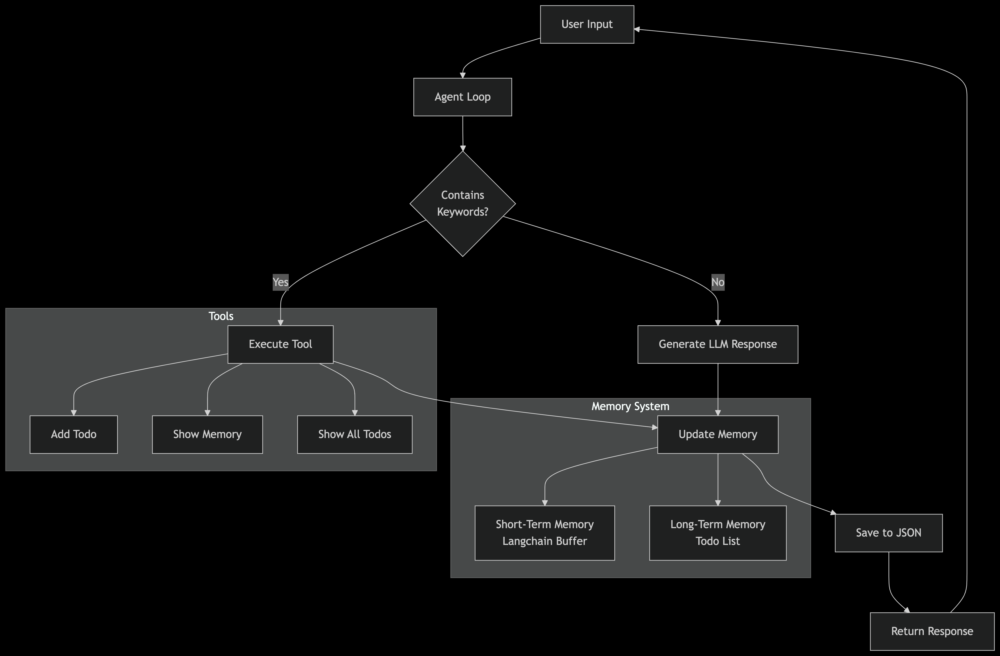

## Modul 3 - Assignment 7 - Eko Setiyo Budi Purnomo
# Gemini AI Personal Assistant

Personal Assistant berbasis LLM Gemini + Langchain, dengan fitur memori percakapan (STM), todo list (LTM), dan tools sederhana.

---

## Fitur

- **Conversational AI**: Menggunakan Google Gemini LLM untuk menjawab pertanyaan dan membantu tugas harian.
- **Short-Term Memory (STM)**: Menyimpan riwayat percakapan terakhir menggunakan Langchain `ConversationBufferMemory`.
- **Long-Term Memory (LTM)**: Menyimpan todo list dan fakta penting secara persisten di file JSON.
- **Tools**:
  - Tambah todo (`add_todo`)
  - Lihat ringkasan memori dan todo (`show_memory`)
  - Lihat seluruh todo (`show_all_todo`)
- **Prompt RAG**: Menggabungkan hasil retrieval STM & LTM ke dalam prompt sebelum dikirim ke LLM (Retrieval-Augmented Generation).

---

## Cara Menjalankan

1. **Clone repository** dan masuk ke folder project.
2. **Install dependencies**:
    ```bash
    pip install python-dotenv google-generativeai langchain
    ```
3. **Siapkan API Key Gemini**:
    - Buat file `.env` di root folder.
    - Tambahkan:
      ```
      GOOGLE_API_KEY=YOUR_API_KEY
      ```
4. **Jalankan program**:
    ```bash
    python ai_agent_gemini.py
    ```

---

## Cara Pakai

- **Tambah todo**:  
  `tambah task [deskripsi tugas]`  
  Contoh: `tambah task beli tiket pesawat`
- **Lihat ringkasan memori & todo**:  
  `memory` atau `ingat`
- **Lihat seluruh todo**:  
  `tampilkan semua todo` atau `lihat todo`
- **Keluar**:  
  Ketik `q`

---

## Struktur Memori

- **STM**: Riwayat percakapan terakhir (max 5) disimpan di buffer.
- **LTM**: Todo list dan fakta penting disimpan di file `agent_gemini_memory.json`.

---

## Diagram Alur Sistem

### Alur Eksekusi Tools & LLM


### Arsitektur Agent Loop & Memory


---

## Strategi RAG (Retrieval-Augmented Generation)

Pada aplikasi ini, strategi RAG yang digunakan adalah **prompt augmentation berbasis retrieval dari memori internal**:
- **Retrieval**: Mengambil 5 percakapan terakhir dari Short-Term Memory (STM) dan 5 todo terakhir dari Long-Term Memory (LTM).
- **Augmentasi Prompt**: Hasil retrieval tersebut dimasukkan ke dalam prompt yang diberikan ke LLM (Gemini) setiap kali user memberikan input.
- **Tujuan**: Dengan strategi ini, model dapat menjawab dengan mempertimbangkan konteks percakapan sebelumnya dan todo yang sedang berjalan, sehingga respons lebih relevan dan personal.

---

## Kendala Saat Pembuatan

- **Integrasi Memori**: Sinkronisasi antara STM (Langchain) dan LTM (file JSON) membutuhkan penyesuaian agar data tidak hilang saat program dimulai ulang.
- **Prompt Engineering**: Mendesain prompt yang efektif agar Gemini dapat memahami konteks, instruksi, dan tools yang tersedia.
- **Penggunaan Tools**: Deteksi perintah user agar tools (seperti tambah todo atau tampilkan memory) dapat dijalankan secara otomatis dan respons tetap natural.
- **Batasan Model**: Model Gemini kadang tidak selalu mengikuti instruksi tools secara eksplisit, sehingga perlu balancing antara jawaban LLM dan hasil tools.
- **Error Handling**: Menangani error dari API Gemini dan proses baca/tulis file memori agar aplikasi tetap stabil.


---

## Lisensi

MIT License